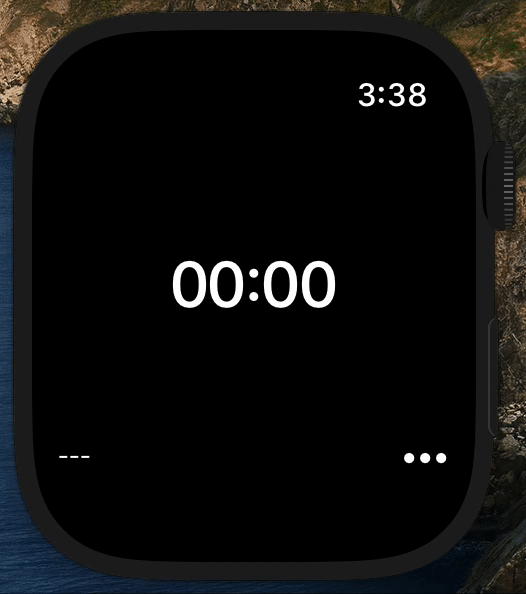
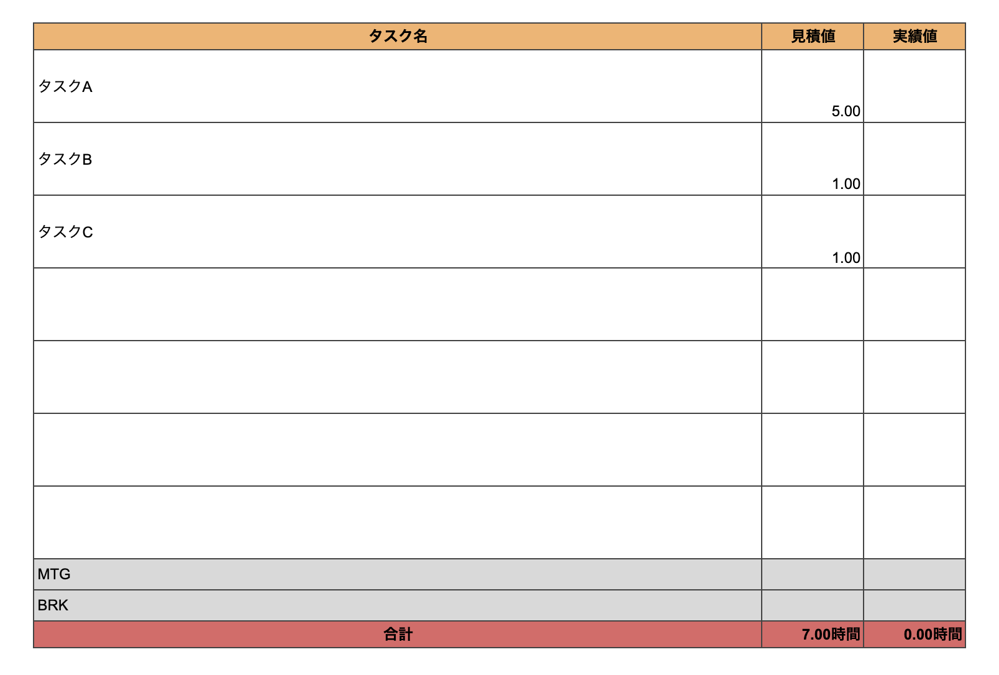

# Pomo
Apple Watch上で動作するポモドーロタイマー。Spread Sheets上のタスクと連動。

 
　　　　　　　Apple Watch画面 

 
　　　　　　　　　　　　Spread Sheets画面 

## Usage
* Apple Watch上でポモドーロタイマーの操作が可能
* Spread Sheets上のタスクをアプリ上で選択可能
	* 固定タスク（MTG, SBR, LBR）や終了操作（FIN）を別途操作可能
* 経過時刻をタイマー表示＆グラフ表示

## Next
* 終了時刻にバイブレーションで通知

### Reference
1. 環境設定
    * [Apple Watchアプリ開発の超絶基礎・通信編 2022版](https://tech-blog.cloud-config.jp/2022-04-07-apple-watch-app-method/)